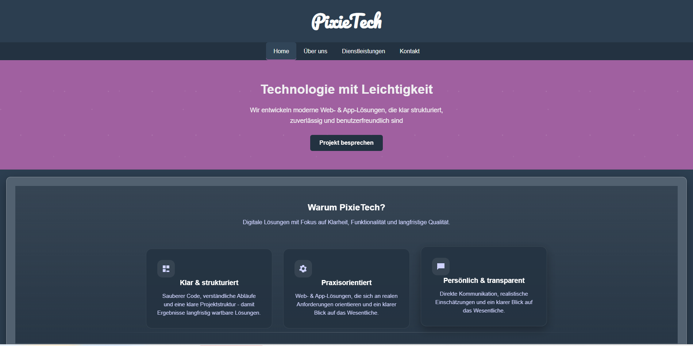
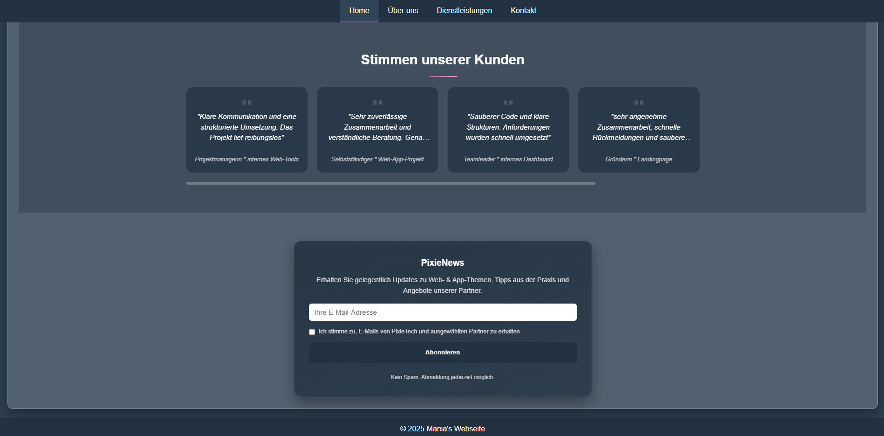
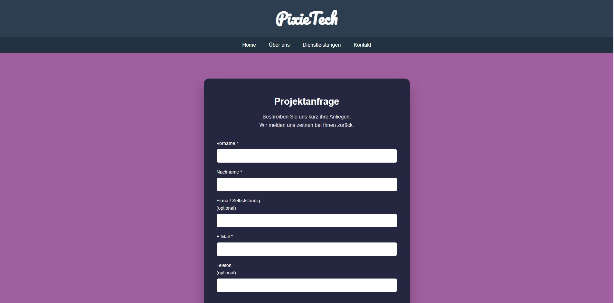
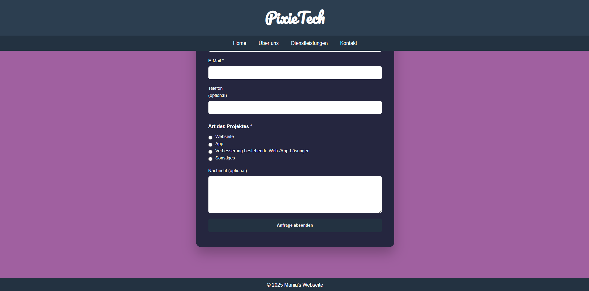

# PixieTech 
PixieTech ist eine Full-Stack Webanwendung, die mit Django entwickelt wurde.
Die Anwendung ermöglicht es Benutzern, Projektanfragen zu senden, Nachrichten zu übermitteln 
ud sich für einen Newsletter anzumelden.

Live Demo:
https://pixietech-fullstack.onrender.com/

## Funktionen 
- Senden einer Projektanfrage über ein Formular
- Kontaktformular für kurze Nachrichten
- Newsletter-Abonnement
- Speicherung der Daten in der Datenbank
- Administrationsbereich zur Datenbank
- Administrationsbereich zur Verwaltung der Anfragen und -nachrichten

## Technologien
Backend:
- Python
- Django 4.2.16
- Django Admin
- Dganjo Forms
  
Frontend:
- HTML
- CSS
- JavaScript
  
Datenbank:
- SQLite/postgreSQL

Deployment:
- Render

## Architektur
Die Anwendung basiert auf dem Django Framework.
- Frontend: HTML, CSS, JavaScript
- Backend: Django(python)
- Datenbank: Speicherung der Benutzerdaten über Django Models
- Deployment: Render

## Projektziel
Dieses Projekt wurde im Rahmen meiner Umschulung zur Fachinformatikerin für Anwendungsentwicklung entwickelt,
um praktisches Erfahrungen in der Webentwicklung mit Django zu sammeln.
Der Fokus lag auf der Entwicklung einer vollstangigen Webanwendung mit Backend,
Frontend, Datenbank und Deployment.

## Administrationsbereich
Der Django-Adminbereich ermöglich die Verwaltung von:
- Projektanfragen
- Nachtichten
- Newsletter-Abo

## Zukunftige Verbesserungen
- Verbesserung des Designs
- Erweiterung der Funktionalität
- Optimierung der Benutzerfreundlichkeit

## Screenshots

## Autorin
Dieses Projekt wurde von mir im Rahmen meiner Umschulung zur Fachinformatikerin 
für Anwendungsentwicklung entwickelt, mit dem Ziel, praktische Erfahrungen in der Fill-Stack-Webentwicklung zu sammeln.

## Status 
Aktiv entwickelt und online vwerfügbar.
