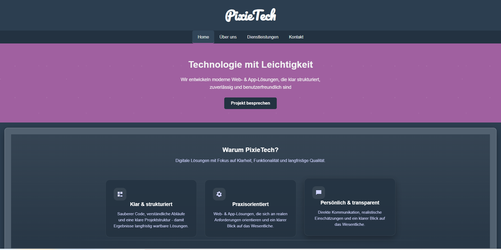
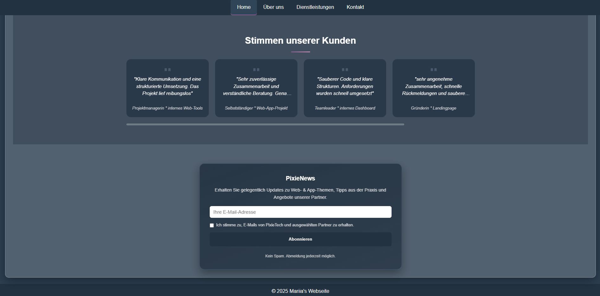
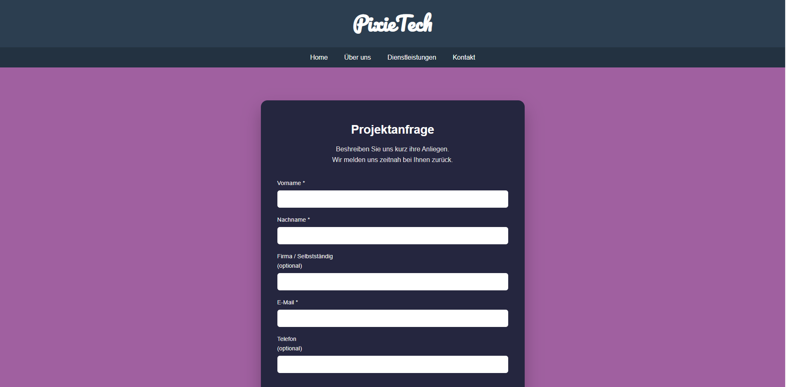
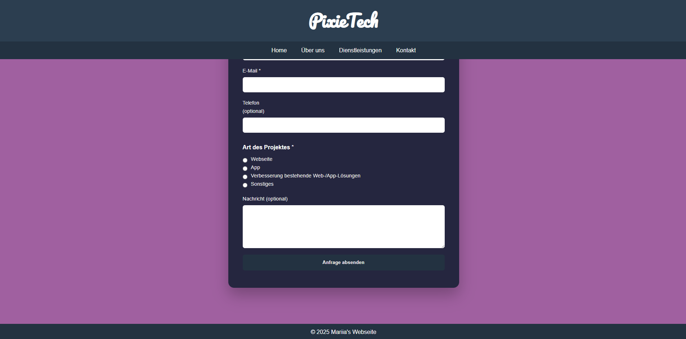

# PixieTech 
PixieTech is eine Full-stack web application built with Django. 
The Application allows users to submit project inquiries, send contact messages and subscribe to a newsletter.

Live Demo:
https://pixietech-fullstack.onrender.com/

## Features
- Submit project inquiries through a contact form.
- Send short contact messages.
- Newsleter subscription.
- Store user submissions in a database.
- Django Admin panel for managing inquiries and messages.
- Database-backend content management.

## Tech Stack
Backend:
- Python
- Django 4.2.16
- Django Admin
- Django Forms
  
Frontend:
- HTML
- CSS
- JavaScript
  
Datenbank:
- SQLite/postgreSQL

Deployment:
- Render

## Architecture
The application follows a traditional Django MVC-style architecture:
- Frontend: HTML, CSS, JavaScript
- Backend: Django(python)
- Datenbank: Speicherung der Benutzerdaten über Django Models
- Deployment: Render

## Project Goal
This project was developed during my 
vocational retraining program as an 
Application Development Specialist 

The goal was to gain practical experience in 
full-stack web-development by building a 
complete web-application including 
frontend, backend, database integration 
and deployment.

## Admin Panel
The Django Admin interface allows management of:
- Project inquiries
- Contact messages
- Newsletter subscriptions

## Future improvements
- Improved UI/UX design
- User authenication and accoints
- Email notifications
- Enhanced form validation
- Dashboard analytics

## Screenshots

für Anwendungsentwicklung entwickelt, mit dem Ziel, praktische Erfahrungen in der Fill-Stack-Webentwicklung zu sammeln.

## Status 
Aktiv entwickelt und online verfügbar.
